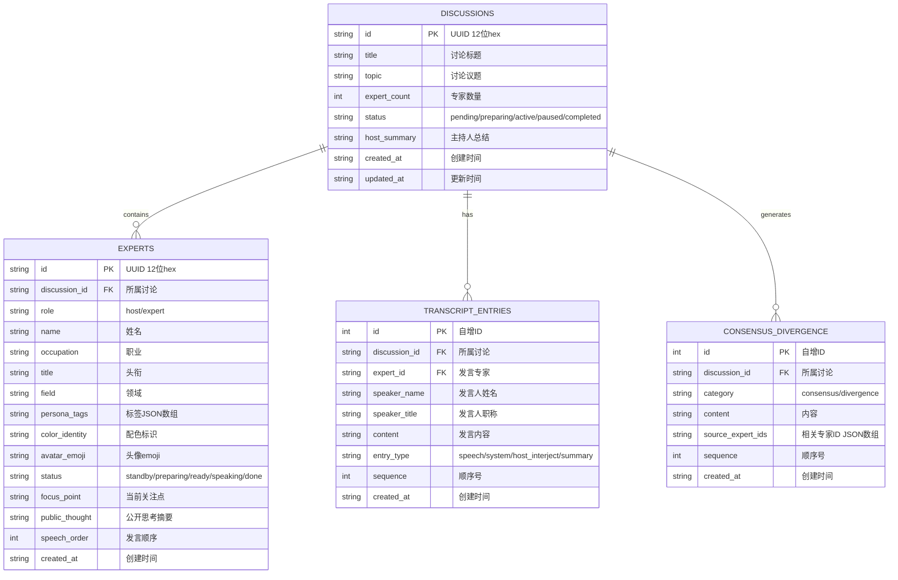
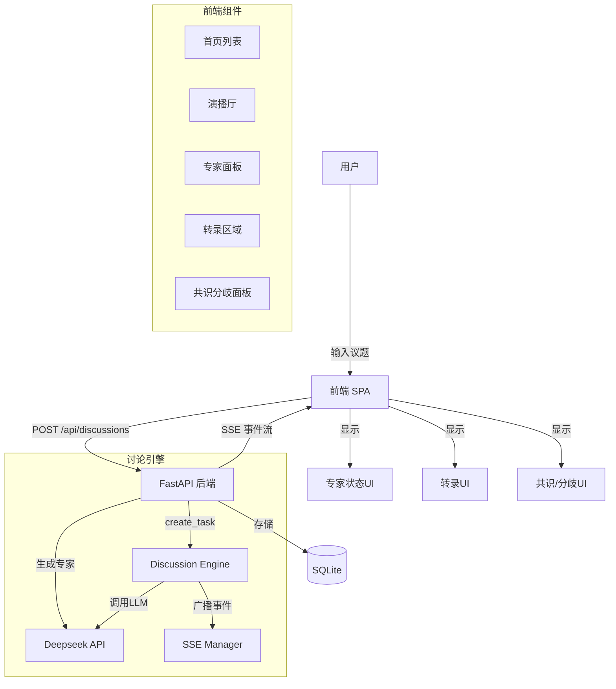
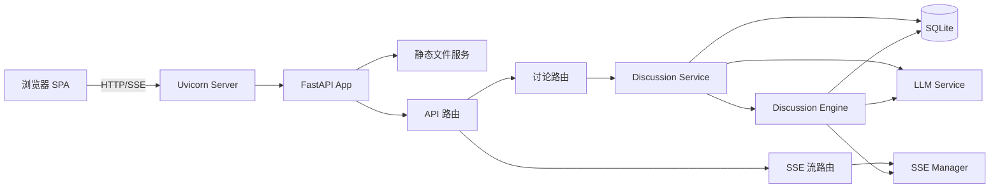

# AI Panel Studio — ER 图

## 实体关系图 (Mermaid)

```mermaid
erDiagram
    DISCUSSIONS ||--o{ EXPERTS : contains
    DISCUSSIONS ||--o{ TRANSCRIPT_ENTRIES : has
    DISCUSSIONS ||--o{ CONSENSUS_DIVERGENCE : generates

    DISCUSSIONS {
        string id PK "UUID 12位hex"
        string title "讨论标题"
        string topic "讨论议题"
        int expert_count "专家数量"
        string status "pending/preparing/active/paused/completed"
        string host_summary "主持人总结"
        string created_at "创建时间"
        string updated_at "更新时间"
    }

    EXPERTS {
        string id PK "UUID 12位hex"
        string discussion_id FK "所属讨论"
        string role "host/expert"
        string name "姓名"
        string occupation "职业"
        string title "头衔"
        string field "领域"
        string persona_tags "标签JSON数组"
        string color_identity "配色标识"
        string avatar_emoji "头像emoji"
        string status "standby/preparing/ready/speaking/done"
        string focus_point "当前关注点"
        string public_thought "公开思考摘要"
        int speech_order "发言顺序"
        string created_at "创建时间"
    }

    TRANSCRIPT_ENTRIES {
        int id PK "自增ID"
        string discussion_id FK "所属讨论"
        string expert_id FK "发言专家"
        string speaker_name "发言人姓名"
        string speaker_title "发言人职称"
        string content "发言内容"
        string entry_type "speech/system/host_interject/summary"
        int sequence "顺序号"
        string created_at "创建时间"
    }

    CONSENSUS_DIVERGENCE {
        int id PK "自增ID"
        string discussion_id FK "所属讨论"
        string category "consensus/divergence"
        string content "内容"
        string source_expert_ids "相关专家ID JSON数组"
        int sequence "顺序号"
        string created_at "创建时间"
    }
```

## 数据流图

```mermaid
flowchart TD
    U[用户] -->|输入议题| FE[前端 SPA]
    FE -->|POST /api/discussions| BE[FastAPI 后端]
    BE -->|生成专家| LLM[Deepseek API]
    BE -->|存储| DB[(SQLite)]
    BE -->|SSE 事件流| FE
    FE -->|显示| EUI[专家状态UI]
    FE -->|显示| TUI[转录UI]
    FE -->|显示| CD[共识/分歧UI]
    
    subgraph 讨论引擎
        BE -->|create_task| DE[Discussion Engine]
        DE -->|调用LLM| LLM
        DE -->|广播事件| SSE[SSE Manager]
    end
    
    subgraph 前端组件
        Home[首页列表]
        Studio[演播厅]
        ExpertPanel[专家面板]
        Transcript[转录区域]
        ConsensusPanel[共识分歧面板]
    end
```

## 架构图

```mermaid
flowchart LR
    Client[浏览器 SPA] -->|HTTP/SSE| Server[Uvicorn Server]
    Server --> FastAPI[FastAPI App]
    FastAPI --> Static[静态文件服务]
    FastAPI --> API[API 路由]
    API --> DiscussionAPI[讨论路由]
    API --> StreamAPI[SSE 流路由]
    
    DiscussionAPI --> DS[Discussion Service]
    StreamAPI --> SSE[SSE Manager]
    
    DS --> DB[(SQLite)]
    DS --> LLM[LLM Service]
    DS --> DE[Discussion Engine]
    
    DE --> SSE
    DE --> LLM
    DE --> DB
```
